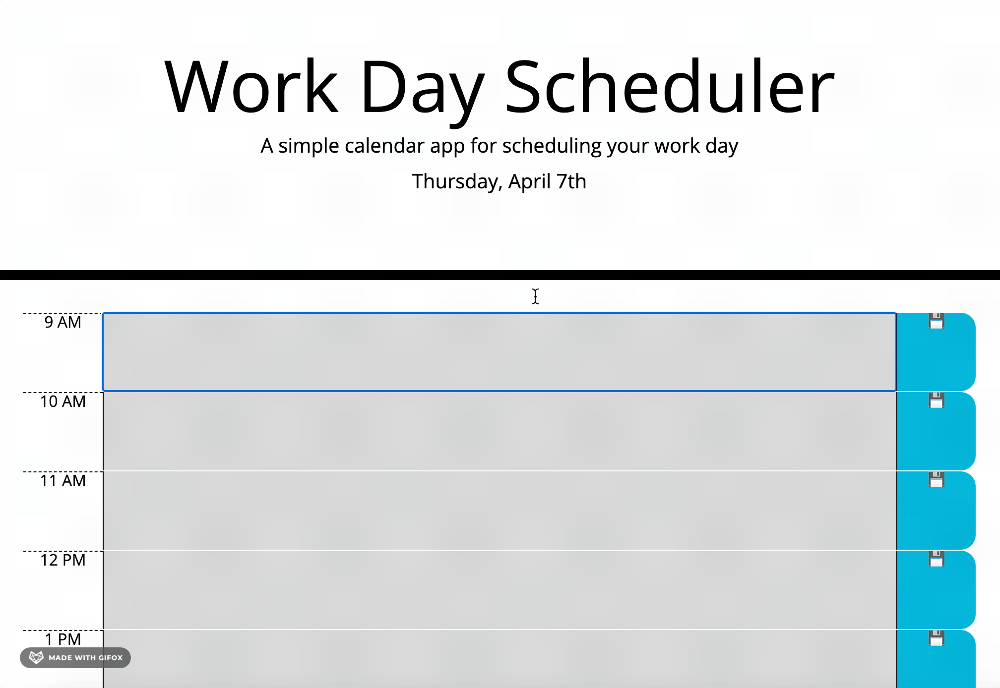
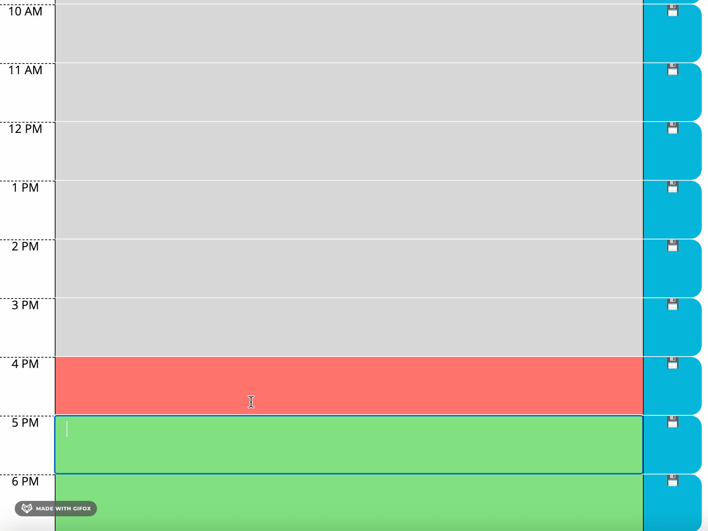

# **Workday-Scheduler**
Welcome to the Workday Scheduler web app! This simple planner app can help you plan out your workday.

## **How to Use**

---

You can visit the web app by clicking the link [here](https://coderbennett.github.io/Workday-Scheduler/).

Upon visiting the page you will notice the current date at the top of the page. Below that you will be able to see each hour of the workday, a text area, and a save button to the right side. This can be seen below:

You are able to add your own text to the text area provided between the hour and save button.

The changes to the scheduler will be saved to your local storage upon clicking the save button so when you refresh the page, or revisit the page, the plans you made will still be there.

## **About the Author**

---

Hello there!👋🏻 My name is Joey Bennett and I am a Jr. Web Developer! I am learning to use JavaScript and web APIs like [Moment.js](https://momentjs.com) & [jQuery](https://api.jquery.com) in projects like this one.

Below this section I will have some extra notes on how I made this web app if that is something you're interested in!

Also if you are interested in checking out any of my other projects, my social or reaching out to me, feel free to visit any of my social sites below:

* [LinkedIn](https://www.linkedin.com/in/joey-bennett-jkb/)
* [GitHub](https://github.com/coderbennett)
* [Twitter](https://twitter.com/joeykalanchoe)
* [Portfolio](https://coderbennett.github.io/portfolio-flat/)

## **Extra Notes**

---

The two main features I introduced in this project are [jQuery](https://api.jquery.com) and [Moment.js](https://momentjs.com). 

I should start by pointing out that my code is thoroughly commented and can be easily viewed [here](assets/script.js) on GitHub, but I will bring a few snippets below to point out some of the most important and interesting aspects.

---

The following code is found between lines 71-75 in the [script.js](assets/script.js) file, and is vital for the save button functionality.

    tempRowEl = $("
");
    tempRowEl.addClass('col-1 saveBtn');
    tempRowEl.attr('index', i);
    tempRowEl.html('💾')
    timeblockElArray[i].append(tempRowEl);

We are using a temporary variable named <code>tempRowEl</code> to create, store, and add data attributes to the save button depending on which row it is in.

We are also using BootStrap in this project and we add classes to the save button so it fills up the appropriate space on the page. 

One of the most important aspects of this snippet of code is the adding of index as a data attribute. This is how we are able to identify where to store the user input within our descriptions array in the **saveDescription** function which is shown below:

---

    function saveDescription(event){
    var el = event.target;

    descriptions[$(el).attr("index")] = $(el).prev().val();

    localStorage.setItem("descriptions", JSON.stringify(descriptions));
    }

The above code snippet contains the **saveDescription** function declaration. This function is called when any save button is clicked. We first set a pointer to the element named <code>el</code>.

From there we find the sibling container which for all save buttons would be the text area. We take the value (which is a string of text/anything the user input to the text area) and we store it to the descriptions array, at the specific index in which the save button element is.

Lastly, we store the updated descriptions array to localStorage.